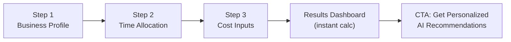

# AI Savings Calculator for [BrighterBiz.ai](http://BrighterBiz.ai)

## Product Rationale

SMB owners know AI is important but struggle to justify the investment. The savings calculator bridges that gap by translating abstract AI capabilities into concrete dollar figures and hours saved -- the language business owners actually think in. This page serves dual purposes: **lead generation** (captures business data for consultation follow-up) and **education** (shows which AI workflows deliver the most ROI for their specific business).

---

## Calculator Design: What We Are Calculating

As a senior AI PM, the savings model is grounded in **real labor displacement and efficiency multipliers** across six core SMB operational areas:


| Area | Typical SMB Pain | AI Solution | Benchmark Savings |
| ---- | ---------------- | ----------- | ----------------- |


- **Customer Service**: Phone/email volume, after-hours coverage gaps --> AI chatbots + voice agents reduce support labor by 40-60%, enable 24/7 without additional headcount
- **Marketing & Content**: Hours creating social posts, emails, blog content --> AI content generation cuts production time by 60-70%, reduces agency spend
- **Admin & Scheduling**: Data entry, appointment booking, document processing --> Automation eliminates 70-80% of manual admin hours
- **Sales & Lead Management**: Manual follow-ups, unqualified leads, CRM updates --> AI lead scoring + automated nurture saves 10-15 hrs/week per rep
- **Finance & Invoicing**: Manual invoicing, expense tracking, reconciliation --> AI processing reduces bookkeeping labor by 50-60%
- **HR & Hiring**: Resume screening, onboarding docs, policy Q&A --> AI screening cuts hiring time by 40-50%

The calculator uses **industry-validated efficiency multipliers** (configurable in a constants file) applied against the user's actual labor hours and costs to produce savings estimates.

---

## UX Flow: Multi-Step Interactive Form




**Step 1 -- Business Profile** (4 fields)

- Industry (dropdown: Restaurant, Retail, Professional Services, Healthcare, Real Estate, E-commerce, Fitness, Legal, Accounting, Other)
- Number of employees (slider or segmented: 1-5, 6-15, 16-50, 51-100)
- Monthly revenue range (segmented: Under $25K, $25K-$100K, $100K-$500K, $500K+)
- Current use of AI tools (None, Basic/some, Moderate, Advanced)

**Step 2 -- Time Allocation** (hours/week per area)

- Customer support & inquiries
- Marketing & content creation
- Admin, scheduling, & data entry
- Sales outreach & follow-ups
- Bookkeeping & invoicing
- Hiring & HR tasks

Each uses a slider (0-40 hrs/week) with smart defaults based on industry selected in Step 1. Pre-populated values reduce friction.

**Step 3 -- Cost Inputs** (2 fields)

- Average hourly labor cost (slider: $15-$75/hr, default $25)
- Current monthly spend on software/tools (optional, input field)

**Results Dashboard** -- Two-phase rendering:

**Phase 1: Instant Client-Side Calculations** (renders immediately, no API call)
- **Hero metric**: Total estimated annual savings (large animated count-up number)
- **Secondary metrics**: Hours saved per week, monthly cost reduction, ROI payback period
- **Breakdown chart**: Per-area savings (horizontal bar chart or stacked visual)
- **Per-area cards**: Each of the 6 areas showing current cost vs. AI-augmented cost and hours saved

**Phase 2: AI-Powered Deep Analysis** (streams in while user reviews Phase 1 numbers)
- Automatically triggered in background when Phase 1 renders
- **Personalized narrative**: 2-3 paragraph executive summary of the business's AI opportunity, tailored to their industry and profile
- **Per-area AI insights**: Each area card enriches with AI-generated insight text explaining *why* AI helps here and *what specifically* to implement (replaces generic descriptions)
- **Prioritized roadmap**: AI ranks the 6 areas by ROI and generates a "Start Here → Then → Then" implementation sequence
- **Tool recommendations**: AI selects 2-3 specific tools per area matched to the business's industry, size, and budget (not a static lookup table)
- **Risk/consideration callouts**: AI flags any areas where savings estimates may be conservative or aggressive for this specific business type
- **CTA**: "Get Your Personalized AI Roadmap" button that navigates to the existing `/results` flow (or opens consultation modal)

This two-phase approach gives instant gratification (numbers appear immediately) while the AI analysis loads in the background (~2-4 seconds). Users see a subtle loading shimmer on the AI insight sections that resolves as data arrives.

---

## Technical Architecture

### AI Provider Decision: OpenAI (gpt-4o-mini with Structured Outputs)

**Why OpenAI over Gemini or Anthropic for this use case:**

| Factor | Decision Rationale |
| --- | --- |
| **Already integrated** | Project already uses `openai` v5.1.1 package with established patterns in `/api/recommendations/route.ts`. Zero new dependencies or SDK setup. |
| **Structured Outputs** | OpenAI's `response_format: { type: "json_schema", json_schema: {...} }` guarantees the response matches our TypeScript interface exactly. No JSON parsing hacks, no code-fence stripping. Neither Gemini nor Anthropic offer equivalent schema enforcement. |
| **Cost** | gpt-4o-mini at ~$0.001/request is cost-competitive with Gemini Flash (~$0.0005) and Claude Haiku (~$0.001). At expected volume, the difference is negligible. |
| **Speed** | gpt-4o-mini: ~1-3s response time -- fast enough for the Phase 2 background load pattern. |
| **Upgrade path** | Can swap to `gpt-4o` or `gpt-4.1` for higher quality with a one-line model change -- no architecture changes needed. |
| **Gemini downside** | Would require `@google/generative-ai` package, new API key management, different error handling patterns, and less reliable JSON schema adherence. |
| **Anthropic downside** | Would require `@anthropic-ai/sdk` package, new API key, different streaming patterns. Better at nuanced reasoning but overkill for structured financial output. |

### New Files to Create

- `**[brighterbiz-ai/src/app/savings-calculator/page.tsx](brighterbiz-ai/src/app/savings-calculator/page.tsx)`** -- Main page component with multi-step form and two-phase results dashboard
- `**[brighterbiz-ai/src/app/api/savings-analysis/route.ts](brighterbiz-ai/src/app/api/savings-analysis/route.ts)`** -- API route that calls OpenAI gpt-4o-mini with Structured Outputs to generate personalized AI analysis (see API Design section below)
- `**[brighterbiz-ai/src/components/calculator/CalculatorForm.tsx](brighterbiz-ai/src/components/calculator/CalculatorForm.tsx)**` -- Multi-step form with validation and animated transitions
- `**[brighterbiz-ai/src/components/calculator/SavingsResults.tsx](brighterbiz-ai/src/components/calculator/SavingsResults.tsx)**` -- Results dashboard with animated metrics, breakdown charts, per-area cards, and AI insight panels
- `**[brighterbiz-ai/src/components/calculator/StepIndicator.tsx](brighterbiz-ai/src/components/calculator/StepIndicator.tsx)**` -- Progress indicator (reuse pattern from existing `ProgressTracker`)
- `**[brighterbiz-ai/src/lib/calculator-engine.ts](brighterbiz-ai/src/lib/calculator-engine.ts)**` -- Pure calculation logic: industry benchmarks, efficiency multipliers, savings formulas. No UI. Fully testable.
- `**[brighterbiz-ai/src/lib/calculator-constants.ts](brighterbiz-ai/src/lib/calculator-constants.ts)**` -- Industry defaults, AI efficiency multipliers, tool recommendations per area, cost benchmarks
- `**[brighterbiz-ai/src/lib/calculator-types.ts](brighterbiz-ai/src/lib/calculator-types.ts)**` -- Shared TypeScript types for calculator inputs, client-side results, and AI analysis response schema

### Existing Files to Modify

- `**[brighterbiz-ai/src/app/page.tsx](brighterbiz-ai/src/app/page.tsx)**` -- Add navigation link/CTA to the calculator from the landing page (e.g., in features section or as a new nav item)
- `**[brighterbiz-ai/src/app/globals.css](brighterbiz-ai/src/app/globals.css)**` -- Add any calculator-specific utility classes or animation keyframes if needed

### Key Technical Decisions

- **Hybrid client-side + AI architecture** -- Phase 1 (instant numbers) uses a pure client-side calculation engine for zero-latency results. Phase 2 (AI analysis) calls OpenAI in the background to enrich results with personalized insights, tool recommendations, and a prioritized roadmap. This means the user never waits for AI -- they get instant gratification first, then richer content loads in.
- **OpenAI Structured Outputs** -- The API route uses `response_format: { type: "json_schema" }` to enforce the exact response shape. This eliminates the JSON parsing fragility in the existing `/api/recommendations` route (no more code-fence stripping or bracket-finding).
- **State management** -- React `useState` + `useReducer` for form state (matches existing patterns; no new dependencies).
- **Animations** -- Framer Motion for step transitions, number count-up animations on results, and staggered card reveals (consistent with existing app). AI insight sections use skeleton/shimmer loading states.
- **Components** -- Leverage existing shadcn `Button`, `Card`, `Input` primitives. Build sliders and segmented controls as new calculator-specific components.
- **No new dependencies** -- Everything can be built with the existing stack (React 19, Tailwind v4, Framer Motion, Lucide icons, openai SDK).

### Savings Calculation Logic (in `calculator-engine.ts`)

Core formula per area:

```typescript
// Per-area savings
currentWeeklyCost = hoursPerWeek * hourlyLaborCost
aiEfficiencyMultiplier = getMultiplier(area, industry, currentAIAdoption)
weeklyHoursSaved = hoursPerWeek * aiEfficiencyMultiplier
weeklyCostSaved = weeklyHoursSaved * hourlyLaborCost
aiToolMonthlyCost = getToolCost(area, employeeCount)
netMonthlySavings = (weeklyCostSaved * 4.33) - aiToolMonthlyCost
```

Industry-specific multipliers (examples):

- Restaurant + Customer Service: 0.55 (AI handles 55% of inquiries)
- Professional Services + Admin: 0.70 (automation handles 70% of scheduling/data entry)
- E-commerce + Marketing: 0.65 (AI generates 65% of content workload)

These live in `calculator-constants.ts` and are easy to tune as we gather real user data.

---

## AI Analysis API Design (`/api/savings-analysis/route.ts`)

### Request Schema

The client sends the full calculator form inputs plus the client-side calculated numbers:

```typescript
interface SavingsAnalysisRequest {
  // From Step 1
  industry: string;
  employeeCount: string; // "1-5" | "6-15" | "16-50" | "51-100"
  monthlyRevenue: string; // "Under $25K" | "$25K-$100K" | "$100K-$500K" | "$500K+"
  currentAIAdoption: string; // "None" | "Basic" | "Moderate" | "Advanced"

  // From Step 2 (hours/week per area)
  hoursPerArea: {
    customerService: number;
    marketing: number;
    admin: number;
    sales: number;
    finance: number;
    hr: number;
  };

  // From Step 3
  hourlyLaborCost: number;
  currentToolSpend: number;

  // Client-side calculated totals (passed to AI for context)
  calculatedSavings: {
    totalAnnualSavings: number;
    totalWeeklyHoursSaved: number;
    roiPaybackMonths: number;
    perArea: {
      area: string;
      annualSavings: number;
      weeklyHoursSaved: number;
    }[];
  };
}
```

### Response Schema (enforced via OpenAI Structured Outputs)

```typescript
interface SavingsAnalysisResponse {
  executiveSummary: string; // 2-3 paragraphs: personalized narrative about this business's AI opportunity

  areaInsights: {
    area: string; // matches the 6 areas
    headline: string; // e.g., "Your biggest quick win"
    insight: string; // 2-3 sentences explaining WHY AI helps here for THIS business
    specificActions: string[]; // 2-3 concrete actions (e.g., "Set up a Tidio chatbot on your website to handle after-hours FAQs")
    recommendedTools: {
      name: string;
      monthlyPrice: string; // e.g., "$29/mo"
      reason: string; // Why this tool fits their business
    }[];
    confidenceNote: string; // e.g., "Conservative estimate -- restaurants typically see even higher savings here"
  }[];

  prioritizedRoadmap: {
    phase: string; // "Start Here" | "Next" | "Then" | "Advanced"
    area: string;
    reason: string; // Why this should be done in this order
    timeframe: string; // e.g., "Week 1-2"
  }[];

  overallConfidence: string; // "Conservative" | "Moderate" | "Aggressive"
  caveat: string; // One sentence about what could affect accuracy
}
```

### OpenAI API Call Pattern

```typescript
import OpenAI from 'openai';

const openai = new OpenAI({ apiKey: process.env.OPENAI_API_KEY });

const completion = await openai.chat.completions.create({
  model: "gpt-4o-mini",
  messages: [
    {
      role: "system",
      content: `You are a senior AI business consultant specializing in small business operations.
You analyze business data and provide specific, actionable AI implementation recommendations.
Your tone is professional but accessible -- you speak to business owners, not engineers.
You ground your insights in the specific numbers provided, referencing the user's industry,
team size, and time allocation. Never be generic.`
    },
    {
      role: "user",
      content: buildAnalysisPrompt(requestData) // Constructs prompt from form + calculated data
    }
  ],
  temperature: 0.6, // Slightly lower than recommendations for more consistent financial analysis
  max_tokens: 2500,
  response_format: {
    type: "json_schema",
    json_schema: {
      name: "savings_analysis",
      strict: true,
      schema: SAVINGS_ANALYSIS_SCHEMA // JSON Schema matching SavingsAnalysisResponse
    }
  }
});
```

### Key differences from existing `/api/recommendations` route:
- **Structured Outputs** -- Uses `response_format.json_schema` instead of hoping for valid JSON and stripping code fences. This guarantees the response exactly matches the schema, eliminating the parsing hacks in the current recommendations route.
- **Richer context** -- The prompt includes the client-side calculated numbers so the AI can reference specific dollar figures in its narrative ("Your $38,400 in customer service savings represents your biggest opportunity...")
- **Lower temperature (0.6)** -- Financial analysis benefits from more deterministic output than creative recommendations.
- **Typed response** -- The response is parsed directly into `SavingsAnalysisResponse` with no field validation needed (the schema enforces it).

### Prompt Design Strategy

The prompt to OpenAI is constructed from the user's inputs and includes:

1. **Business context block**: Industry, employee count, revenue range, current AI usage
2. **Time allocation block**: Hours/week per area (only areas with >0 hours)
3. **Financial context**: Hourly labor cost, current tool spend
4. **Pre-calculated numbers**: Client-side savings figures for each area (so the AI can reference exact dollar amounts)
5. **Instructions**: Generate the executive summary, per-area insights, prioritized roadmap, and confidence assessment
6. **Few-shot guidance**: Example of a good vs. bad insight for a specific industry to calibrate tone and specificity

Example prompt excerpt:
```
Analyze this business and provide a personalized AI implementation analysis:

BUSINESS PROFILE:
- Industry: Restaurant
- Team size: 6-15 employees
- Monthly revenue: $25K-$100K
- Current AI adoption: None

TIME ALLOCATION (hours/week):
- Customer service & inquiries: 25 hrs/week
- Marketing & content: 8 hrs/week
- Admin & scheduling: 15 hrs/week
- Sales outreach: 5 hrs/week
- Bookkeeping & invoicing: 10 hrs/week
- Hiring & HR: 3 hrs/week

FINANCIALS:
- Average hourly labor cost: $18/hr
- Current monthly tool spend: $200/mo

PRE-CALCULATED SAVINGS (reference these exact figures in your analysis):
- Customer Service: $23,400/yr savings, 13.8 hrs/week saved
- Admin & Scheduling: $13,650/yr savings, 10.5 hrs/week saved
- ...
- TOTAL: $52,800/yr annual savings, 28.3 hrs/week saved

YOUR TASK: Provide a personalized AI implementation analysis following
the schema. Reference the specific dollar figures and hours above.
Tailor all tool recommendations to the restaurant industry.
```

### Error Handling & Cost

- **Retry logic**: 2 retries with exponential backoff (consistent with recommendations from results.md)
- **Fallback**: If OpenAI fails after retries, the results page still shows Phase 1 client-side numbers -- the AI section shows a graceful "Analysis unavailable" message with a "Retry" button
- **Cost per request**: ~$0.001-0.002 (gpt-4o-mini, ~600 input tokens + ~1500 output tokens)
- **Rate limiting**: Reuse the same rate limiting pattern planned for the recommendations endpoint

---

## Landing Page Integration

Add a new section or CTA on the home page that drives traffic to the calculator:

- **Option A**: New "Calculate Your Savings" card in the features section with a link to `/savings-calculator`
- **Option B**: Secondary CTA button in the hero alongside the existing form: "Or calculate your AI savings first"
- **Option C**: Both -- a hero CTA and a dedicated features card

Recommend **Option C** for maximum visibility. The calculator serves as an alternative entry point for users who are not ready to describe their business in a free-text field but will engage with a structured, low-commitment interaction.

Add "Calculator" to the navigation items array in `page.tsx`.

---

## Results Dashboard Wireframe

### Phase 1: Instant (client-side, renders immediately)

```
+--------------------------------------------------+
|  YOUR AI SAVINGS POTENTIAL                        |
|                                                   |
|  [$142,500]        [18.5 hrs]      [3.2 months]  |
|  Est. Annual       Hours Saved     ROI Payback    |
|  Savings           Per Week        Period          |
+--------------------------------------------------+
|                                                   |
|  SAVINGS BY AREA              [bar chart visual]  |
|  Customer Service  ========== $38,400/yr          |
|  Admin & Ops       ========   $32,200/yr          |
|  Marketing         =======    $28,600/yr          |
|  Sales             ======     $22,100/yr          |
|  Finance           ====       $14,200/yr          |
|  HR                ==         $7,000/yr           |
+--------------------------------------------------+
|                                                   |
|  [Card: Customer Service]  [Card: Admin & Ops]    |
|  Current: $X/mo            Current: $X/mo         |
|  With AI: $Y/mo            With AI: $Y/mo         |
|  Save: Z hrs/wk            Save: Z hrs/wk         |
|  ┌─────────────────────┐   ┌─────────────────────┐|
|  │ ░░░ AI insights     │   │ ░░░ AI insights     │|
|  │ ░░░ loading...      │   │ ░░░ loading...      │|
|  └─────────────────────┘   └─────────────────────┘|
+--------------------------------------------------+
```

### Phase 2: AI-Enriched (loads ~2-4s after, shimmer resolves)

```
+--------------------------------------------------+
|  AI ANALYSIS                  [powered by OpenAI] |
|                                                   |
|  "Your restaurant is spending 25 hours/week on    |
|   customer inquiries -- that's your single        |
|   biggest opportunity. With a $29/mo chatbot,     |
|   you could reclaim 13.8 hours/week and save      |
|   $23,400/year. Here's your roadmap..."           |
|                                                   |
|  Confidence: Moderate | Based on restaurant data  |
+--------------------------------------------------+
|                                                   |
|  [Card: Customer Service]  [Card: Admin & Ops]    |
|  Current: $X/mo            Current: $X/mo         |
|  With AI: $Y/mo            With AI: $Y/mo         |
|  Save: Z hrs/wk            Save: Z hrs/wk         |
|  AI Insight: "Your         AI Insight: "With 15   |
|   biggest quick win..."     hrs/week in admin..."  |
|  Tools:                    Tools:                  |
|   - Tidio ($29/mo)          - Calendly ($12/mo)   |
|   - Intercom ($74/mo)       - Zapier ($20/mo)     |
|   Why: "Handles after-      Why: "Automates your  |
|    hours restaurant..."      booking flow..."      |
+--------------------------------------------------+
|                                                   |
|  YOUR AI IMPLEMENTATION ROADMAP                   |
|                                                   |
|  [1. Start Here]     [2. Next]       [3. Then]    |
|  Customer Service    Admin & Ops     Marketing     |
|  "Biggest ROI for    "Quick setup    "Scale your   |
|   your budget..."     with Zapier..."  content..."  |
|  Week 1-2            Week 3-4        Month 2       |
+--------------------------------------------------+
|                                                   |
|  [Get Your Personalized AI Roadmap -->]           |
|  [Book a Free Consultation]                       |
+--------------------------------------------------+
```

---

## Edge Cases and Product Details

- **Zero hours in an area**: Skip that area in results (don't show $0 cards)
- **Very small businesses (1-2 employees)**: Adjust messaging -- "savings" reframe as "hours you get back" since owner is likely the labor
- **Already using AI**: Reduce multipliers proportionally based on Step 1 AI adoption answer
- **Mobile**: Full responsive design; step form goes full-width, results stack vertically, bar chart becomes horizontal cards
- **Dark mode**: Fully supported via existing CSS variable system
- **Shareable results**: Add a "Share Results" button that copies a URL with encoded form state (query params, like existing `/results` pattern) or generates a summary image

---

## SEO and Metadata

The page should have proper Next.js metadata for organic traffic:

- Title: "AI Savings Calculator for Small Business | BrighterBiz.ai"
- Description: "Calculate how much time and money your business could save with AI. Free calculator for small business owners."
- This is a high-intent keyword page that can drive organic leads independently of the main tool.

